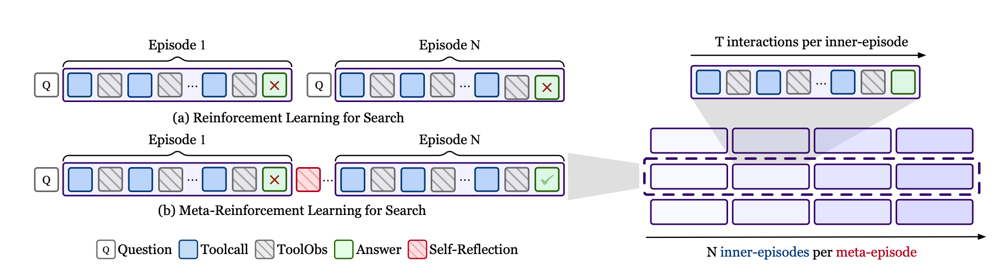
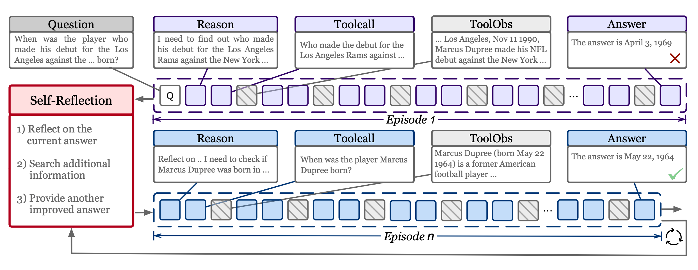

# Meta-Reinforcement Learning with Self-Reflection

<p align="center">
  <a href="https://arxiv.org/abs/2603.11327"></a>
</p>

<p align="center">
  🧠 In-Context Meta-Reinforcement Learning &nbsp;|&nbsp; 🪞 Self-Reflection &nbsp;|&nbsp; 🔁 Learning to learn at test time
</p>

## Introduction

Existing RL-based agentic search methods optimize within a single episode, treating each attempt in isolation. We introduce **MR-Search**, a **Meta-Reinforcement Learning** framework that trains agents to improve **across episodes** via explicit self-reflection. As shown below, MR-Search organizes training into *meta-episodes* of multiple *inner-episodes*. After each failed attempt, the agent generates **Self-Reflection** that is prepended to the next episode, enabling progressive strategy refinement. We train this policy with a **multi-turn RL algorithm** featuring fine-grained credit assignment across the full multi-episode trajectory, achieving **9.2%–19.3% improvements** over strong baselines on  agentic search benchmarks. 

<p align="center">
  
</p>

<p align="center">
  
</p>


---

## Environment Setup

```bash
# Requires: torch==2.6.0 + sglang==0.4.6.post3 + sgl-kernel==0.1.1 + flash-attn==v2.7.4.post1 + verl==0.5.x
conda create -n verl-sglang python==3.10
conda activate verl-sglang
USE_MEGATRON=0 bash install_vllm_sglang_mcore.sh
python -m pip install --no-deps -e .

# Dependencies for retrieval
python -m pip install pyserini==1.2.0 uvicorn==0.35.0 fastapi==0.116.1
conda install -c pytorch -c nvidia faiss-gpu=1.8.0
```

---

## Data Preparation

**(1) Download and process the training/eval dataset.**

```bash
bash scripts/data_process/data_process.sh
```

**(2) Download and process the retrieval corpus.**

```bash
save_path=/path/to/retrieval/data
python scripts/download.py --save_path $save_path
cat $save_path/part_* > $save_path/e5_Flat.index
gzip -d $save_path/wiki-18.jsonl.gz
```

---

## Training

**(1) Launch a retrieval server.**

```bash
# Set $WORK_DIR in retrieval_launch.sh before running
# IP and PORT can be configured in `search_r1/search/retrieval_server.py` (line 392)
# Default endpoint: http://127.0.0.1:8000
conda activate verl-sglang
bash retrieval_launch.sh
```

**(2) Run RL training.**

```bash
# SEARCH_IP must match the IP/PORT configured in `/search/retrieval_server.py` (line 392)
# Default: SEARCH_IP="http://127.0.0.1:8000/retrieve"

conda activate verl-sglang
bash train_grpo_step.sh
```

---

## Checkpoints and Evaluation Results

All checkpoints and evaluation results are saved to the `$WORK_DIR/save` directory.

---

## Acknowledgements

We thank the following open-source projects:
- [VERL](https://github.com/verl-project/verl)
- [Search-R1](https://github.com/PeterGriffinJin/Search-R1)

---

## Citation

If you find this work useful, please cite our paper:

```bibtex
@article{MetaAgent2026,
  title   = {Meta-Reinforcement Learning with Self-Reflection for Agentic Search},
  author  = {Xiao, Teng and Yuan, Yige and Ivison, Hamish and Brahman, Faeze and Zhu, Huaisheng and Lambert, Nathan and Dasigi, Pradeep and Smith, Noah A. and Hajishirzi, Hannaneh},
  journal = {arXiv preprint arXiv:2603.11327},
  year    = {2026}
}
```
